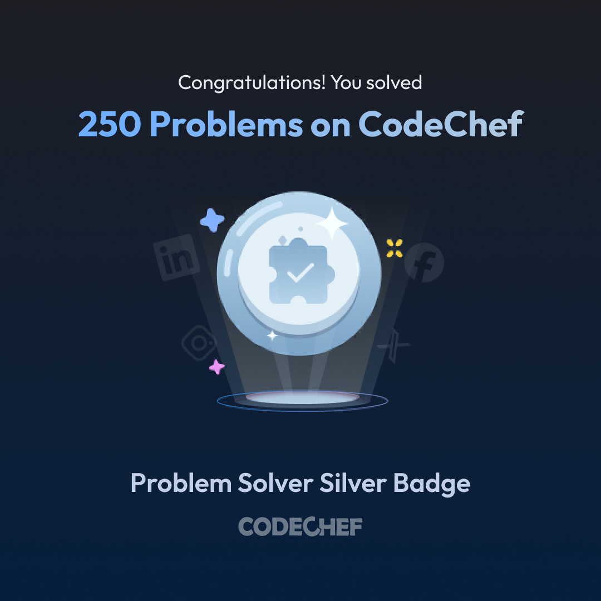

<b>👋 Hi, I’m Gouri!</b>
 
💻 A passionate Computer Science student and aspiring Software Developer . 
🌱 Currently learning Backend Development, DSA in C++, and exploring Machine Learning. 
🎯 Goal: To build impactful projects, crack off-campus opportunities, and grow as a full-stack developer. 
✨ Interests: Web Development, Problem Solving, AI/ML.
## 🌐 Socials:
 

# 💻 Tech Stack:
                       
# 📊 GitHub Stats:
 
 

## 🏆 GitHub Trophies

## 🏅 CodeChef Badges

  
  

### ✍️ Random Dev Quote

---

<!-- Proudly created with GPRM ( https://gprm.itsvg.in ) -->
